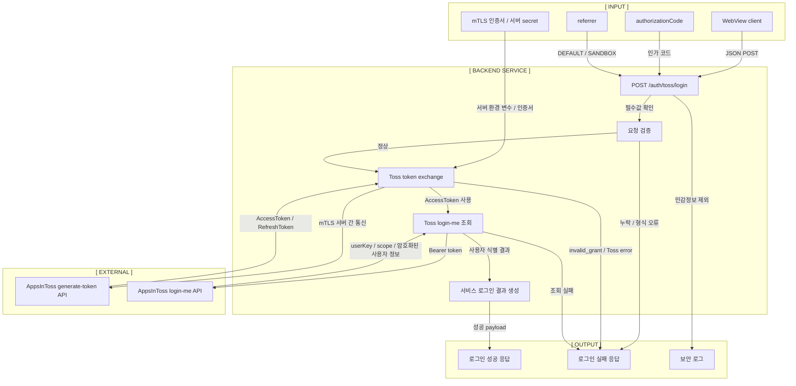

# B00 토스 로그인 백엔드 스펙

## 문서 상태

- 문서 번호: `b00`
- 문서 타입: backend
- 대상 기능: 토스 로그인 토큰 교환
- 현재 단계: 설계
- 마지막 업데이트: 2026-06-29

## 목적

frontend `s00`에서 받은 `authorizationCode`, `referrer`를 서버에서 처리한다.

클라이언트는 인가 코드만 넘기고, AccessToken 발급, 사용자 정보 조회, 세션 처리는 backend에서 맡는다. client secret, Toss API secret, mTLS 인증서, AccessToken, RefreshToken은 WebView 클라이언트에 두지 않는다.

관련 frontend 문서:

```txt
docs/s00-toss-login-auth-spec.md
```

## 현재 결정

```txt
WebView client
-> POST /auth/toss/login
-> AppsInToss Token API로 authorizationCode 교환
-> AppsInToss User API로 사용자 정보 조회
-> 서비스용 로그인 결과 반환
```

이번 문서는 backend 역할을 정의한다. 실제 서버 구현, 배포, DB 스키마는 별도 작업에서 진행한다.

## 전체 흐름



## API 계약

### Request

```txt
POST /auth/toss/login
Content-Type: application/json
```

```json
{
  "authorizationCode": "AUTHORIZATION_CODE_FROM_TOSS",
  "referrer": "DEFAULT",
  "source": "apps-in-toss-webview-poc"
}
```

### Request validation

| field | required | note |
| --- | --- | --- |
| `authorizationCode` | yes | 토스 로그인에서 받은 일회성 인가 코드 |
| `referrer` | yes | `DEFAULT` 또는 `SANDBOX` |
| `source` | no | 클라이언트 구분용 값 |

## 서버 처리 순서

1. 요청 body에서 `authorizationCode`, `referrer`를 확인한다.
2. 누락되었거나 형식이 맞지 않으면 400 응답을 반환한다.
3. AppsInToss Token API에 `authorizationCode`, `referrer`를 전달한다.
4. Token API 호출은 서버 간 통신이며 mTLS 인증서를 사용한다.
5. 발급받은 AccessToken으로 사용자 정보 조회 API를 호출한다.
6. 응답의 `userKey`를 서비스 사용자 식별 기준으로 사용한다.
7. 클라이언트에는 서비스에서 필요한 최소 로그인 결과만 반환한다.

## Toss API

Base URL:

```txt
https://apps-in-toss-api.toss.im
```

Token exchange:

```txt
POST /api-partner/v1/apps-in-toss/user/oauth2/generate-token
```

User info:

```txt
GET /api-partner/v1/apps-in-toss/user/oauth2/login-me
```

## 응답 방향

아직 DB와 세션 방식이 정해지지 않았으므로 최종 응답 스키마는 확정하지 않는다.

Phase 0.5에서는 아래 정도만 반환하는 방향으로 둔다.

```json
{
  "ok": true,
  "userKey": 123456789,
  "scope": "user_key"
}
```

실제 서비스 단계에서는 session id, cookie, JWT 중 어떤 방식을 쓸지 별도 backend/database 문서에서 결정한다.

## 에러 처리

| case | status | note |
| --- | --- | --- |
| 필수값 누락 | 400 | `authorizationCode`, `referrer` 확인 |
| 인가 코드 만료 / 재사용 | 401 | Toss `invalid_grant` 계열 |
| Toss API 실패 | 502 | 외부 API 실패로 취급 |
| 서버 설정 누락 | 500 | mTLS 인증서, secret 설정 확인 |

에러 응답에는 `authorizationCode`, AccessToken, RefreshToken, secret 원문을 넣지 않는다.

## 보안 메모

- `authorizationCode`는 일회성이고 10분 안에 사용해야 한다.
- AccessToken 유효시간은 1시간 기준으로 본다.
- RefreshToken은 서버에서만 보관한다.
- mTLS 인증서와 Toss API secret은 환경 변수 또는 서버 secret storage에 둔다.
- 요청/응답 로그에는 토큰과 인가 코드를 남기지 않는다.
- 클라이언트에 AccessToken, RefreshToken, client secret을 반환하지 않는다.
- 사용자 정보 중 암호화된 필드는 복호화 필요 시 별도 작업으로 분리한다.

## 이번 범위에서 안 하는 것

- 실제 서버 코드 구현
- DB 스키마 설계
- 세션 저장 방식 확정
- 사용자 정보 복호화 구현
- 연결 끊기 API 구현
- Oracle Always Free 배포

## 참고

- Toss Login docs: https://developers-apps-in-toss.toss.im/login/develop.md
