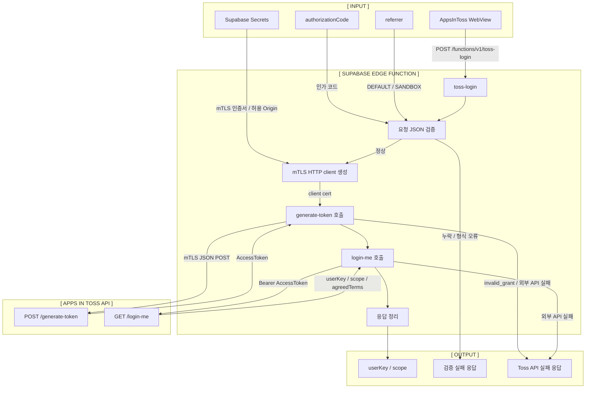

# B01 Supabase 토스 로그인 Edge Function 스펙

## 문서 상태

- 문서 번호: `b01`
- 문서 타입: backend
- 대상 기능: Supabase Edge Function 기반 토스 로그인
- 현재 단계: Phase 0.5 준비
- 마지막 업데이트: 2026-06-29

## 목적

`s00` 프론트엔드에서 받은 `authorizationCode`, `referrer`를 Supabase Edge Function으로 전달하고, Edge Function이 AppsInToss 서버와 mTLS로 통신해서 사용자 식별 결과를 반환한다.

이번 단계의 목표는 WebView에서 받은 토스 로그인 결과가 서버까지 전달되고 `userKey`를 받을 수 있는지 확인하는 것이다. DB 세션 저장은 다음 backend/database 작업으로 분리한다.

관련 문서:

```txt
docs/s00-toss-login-auth-spec.md
docs/b00-toss-login-token-exchange-spec.md
docs/b01-supabase-toss-login-api-contract.md
docs/b01-supabase-toss-login-runbook.md
```

## 현재 결정

```txt
WebView client
-> Supabase Edge Function /functions/v1/toss-login
-> AppsInToss generate-token API
-> AppsInToss login-me API
-> userKey / scope 반환
```

Supabase Auth JWT가 없는 WebView PoC 요청을 받기 위해 `toss-login` 함수의 `verify_jwt`는 끈다.

```toml
[functions.toss-login]
verify_jwt = false
```

## 전체 흐름



## 구현 파일

| 파일 | 역할 |
| --- | --- |
| `supabase/config.toml` | Supabase 프로젝트 및 함수별 설정 |
| `supabase/functions/toss-login/index.ts` | Edge Function 엔트리 |
| `supabase/functions/toss-login/*.ts` | CORS, 요청 검증, mTLS, Toss API helper |
| `supabase/functions/.env.example` | 로컬 실행용 환경 변수 예시 |
