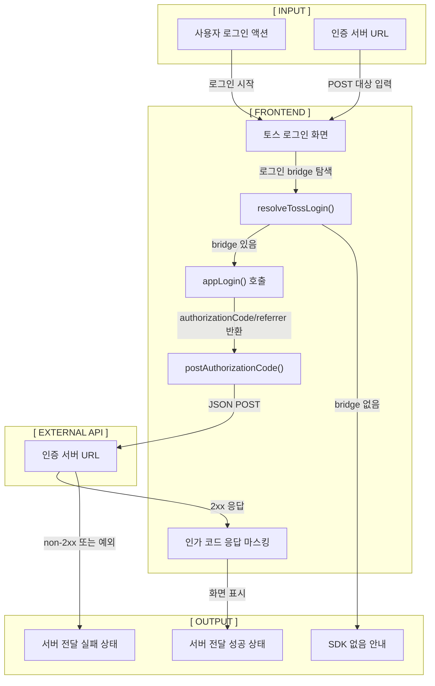

# S00 토스 로그인 프론트엔드 스펙

## 문서 상태

- 문서 번호: `s00`
- 문서 타입: frontend
- 대상 기능: 토스 로그인 클라이언트 골격
- 현재 단계: Phase 0.5 구현
- 마지막 업데이트: 2026-06-29

## 문서 번호 규칙

앞으로 `docs/` 아래 기능 스펙은 영역별 prefix를 붙인다.

| 영역 | prefix | 예시 |
| --- | --- | --- |
| backend | `b00`, `b01`, `b02` | `b00-auth-token-exchange-spec.md` |
| frontend | `s00`, `s01`, `s02` | `s00-toss-login-auth-spec.md` |
| database | `d00`, `d01`, `d02` | `d00-user-session-schema-spec.md` |

이번 문서는 WebView 클라이언트에서 토스 로그인을 시작하는 내용이라 `s00`으로 둔다.

## 목적

사용자별 운동 기록을 저장하려면 먼저 사용자 식별 흐름이 필요하다.

이번 단계에서는 완성형 로그인을 만들지 않고, AppsInToss WebView에서 토스 로그인을 시작한 뒤 `authorizationCode`와 `referrer`를 받아 우리 서버로 넘기는 흐름만 확인한다.

서버 인증, 토큰 교환, 사용자 식별은 backend 문서인 `b00`에서 다룬다.

## 현재 결정

```txt
WebView client
-> appLogin()
-> authorizationCode/referrer 획득
-> 외부 인증 API로 전달
-> 전달 성공/실패 상태 표시
```

이번 문서는 클라이언트 화면 흐름과 외부 인증 API 전달 계약만 정의한다.
실제 화면 구현은 별도 `feature/` 브랜치에서 진행한다.

## 전체 흐름



## 이번 범위

- 토스 로그인 전용 화면을 둔다.
- AppsInToss WebView에서 제공되는 `appLogin` bridge를 찾는다.
- bridge가 있으면 `appLogin()`을 호출한다.
- 성공 시 `authorizationCode`, `referrer`를 받는다.
- 받은 값을 개발자가 입력한 인증 서버 URL로 `POST`한다.
- 서버 응답 status/body를 화면에 표시한다.
- 화면에 표시되는 응답 안에 인가 코드가 포함되면 마스킹한다.
- SDK가 없는 일반 브라우저에서는 명확한 안내를 보여준다.

## 이번 범위에서 안 하는 것

- 인증 서버 내부 구현
- 토큰 교환
- 사용자 식별
- 로그인 세션 유지
- DB 저장
- 실제 서버 배포

위 항목은 backend 스펙인 `docs/b00-toss-login-token-exchange-spec.md`에서 별도로 다룬다.

## 후속 구현 메모

실제 구현 PR에서는 아래 정도로 파일을 나눌 수 있다.

| 역할 | 설명 |
| --- | --- |
| 로그인 화면 | 토스 로그인 시작 버튼과 인증 서버 URL 입력 |
| 화면 상태 처리 | 대기, 로그인 진행, 전달 중, 성공, 실패 상태 표시 |
| 인증 helper | `appLogin` bridge 탐색과 인증 서버 POST |
| 테스트 | bridge 없음, payload 생성, 인가 코드 마스킹 확인 |

## 구현 파일

| 파일 | 역할 |
| --- | --- |
| `src/features/auth/ui/toss-login-panel.tsx` | 토스 로그인 시작, 인증 서버 URL 입력, 결과 상태 표시 |
| `src/features/auth/ui/toss-login-panel.module.css` | 로그인 화면 스타일 |
| `src/features/auth/lib/request-toss-login.ts` | AppsInToss WebView SDK의 `appLogin()` 호출 |
| `src/features/auth/model/toss-login-flow.ts` | 요청 payload 생성, URL 검증, 인가 코드 마스킹 |
| `src/shared/api/toss-auth.ts` | 인증 서버로 `authorizationCode` / `referrer` 전달 |
| `src/features/auth/model/toss-login-flow.test.ts` | payload, URL 검증, 응답 마스킹 테스트 |

홈 화면은 Phase 0.5 검증을 위해 `src/app/page.tsx`에서 로그인 화면을 바로 렌더링한다.

## 클라이언트 계약

### 요청

```txt
POST {authServerUrl}
Content-Type: application/json
```

```json
{
  "authorizationCode": "AUTHORIZATION_CODE_FROM_TOSS",
  "referrer": "DEFAULT",
  "source": "apps-in-toss-webview-poc"
}
```

### 응답 처리

이번 단계에서는 서버 응답 스키마를 고정하지 않는다.

- HTTP status code를 표시한다.
- JSON 응답은 pretty JSON으로 표시한다.
- 그 외 응답은 plain text로 표시한다.
- 2xx 응답이면 서버 전달 성공으로 본다.
- non-2xx 응답이면 서버 전달 실패로 본다.
- 응답 본문에 `authorizationCode` 원문이 들어 있으면 화면 표시 전에 `[REDACTED_AUTHORIZATION_CODE]`로 바꾼다.

## 상태 처리

| 상태 | 화면 표시 |
| --- | --- |
| 대기 | 로그인 대기 중 |
| SDK 없음 | 토스 로그인 SDK는 AppsInToss WebView 환경에서만 사용할 수 있습니다. |
| 로그인 진행 | 토스 로그인 진행 중 |
| 서버 전달 중 | 인가 코드 전달 중 |
| 전달 성공 | 서버 전달 완료 |
| 전달 실패 | 서버 전달 실패 또는 확인 필요 |

## 보안 메모

- `authorizationCode`는 일회성이고 유효시간이 짧으므로 장기 저장하지 않는다.
- `authorizationCode`는 화면/로그에 그대로 남기지 않는다.
- 민감한 인증 값은 클라이언트에 저장하지 않는다.
- 실제 서버 연동 시 HTTPS를 필수로 한다.

## 검증

구현 PR에서는 아래 내용을 확인한다.

- AppsInToss bridge가 없는 일반 브라우저에서는 토스 앱 WebView 환경 안내를 표시한다.
- `authorizationCode`, `referrer`를 인증 서버 URL로 JSON POST한다.
- 화면 표시용 응답에서 인가 코드 원문을 마스킹한다.

로컬 검증 명령:

```bash
npm test
npm run typecheck
npm run lint
npm run build
```

## 참고

- Toss Login docs: https://developers-apps-in-toss.toss.im/login/develop.md
