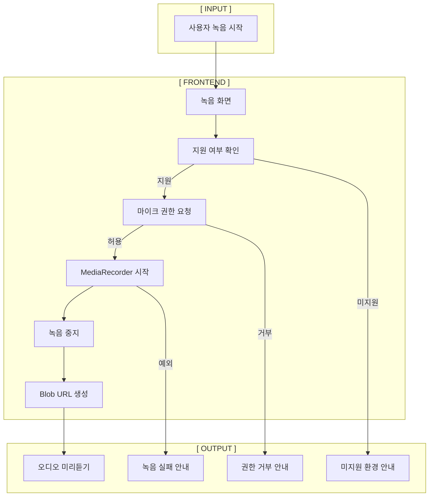

# S01 마이크 녹음 요청 프론트엔드 스펙

## 문서 상태

- 문서 번호: `s01`
- 문서 타입: frontend
- 대상 기능: WebView 마이크 녹음 요청
- 현재 단계: Phase 0 구현 준비
- 마지막 업데이트: 2026-06-30
- 관련 이슈: `docs/issue-drafts/recording-request-issue.md`

## 목적

사용자가 운동 내용을 말로 남길 수 있도록 WebView에서 마이크 권한을 요청하고, 짧은 음성을 녹음한 뒤 미리듣기까지 확인한다.

## 현재 결정

```txt
사용자
-> 녹음 시작 버튼
-> getUserMedia 권한 요청
-> MediaRecorder 녹음
-> 녹음 중지
-> audio Blob 생성
-> 미리듣기 표시
```

서버 업로드, STT, AI 구조화, 로컬 저장은 후속 이슈로 분리한다.

## 전체 흐름



## 상태 모델

상태는 `idle`, `unsupported`, `requestingPermission`, `recording`, `recorded`, `denied`, `failed`로 둔다.

`unsupported`는 `getUserMedia` 또는 `MediaRecorder`가 없을 때 사용한다. `denied`는 권한 거부, `failed`는 그 외 예외 상태로 구분한다.

## 구현 예상 파일

- `src/features/recording/lib/create-audio-recorder.ts`
- `src/features/recording/model/recording-state.ts`
- `src/features/recording/ui/recording-panel.tsx`
- `src/features/recording/ui/recording-panel.module.css`
- `src/features/recording/model/recording-state.test.ts`

## 검증

```bash
npm test
npm run typecheck
npm run lint
npm run build
```

수동으로는 마이크 권한 요청, 녹음 시작/중지, 오디오 미리듣기, 권한 거부/미지원 안내를 확인한다.
